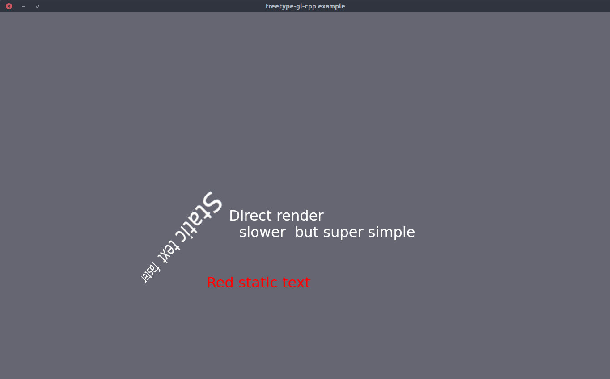

# freetype-gl-cpp
An object-oriented wrapper around freetype-gl, which simplifies text rendering in OpenGL. It's aiming at being easy to use.

## Example usage

In a nutshell, freetype-gl-cpp can be used like this:
```C++
FreetypeGl text_renderer(true);
text_renderer.renderText("Direct render");
```
Or, more object oriented and more efficiently, like this:
```C++
FreetypeGl text_renderer(true);
FreetypeGlText text = text_renderer.createText(std::string("Static text (faster)"));
text.setPosition(5,5,0.5);
text_renderer.renderText(text);
```

Check the [example](example/example.cpp):


## Build / Install

* Checkout recursively, to get *freetype-gl* dependency
* Use CMake and make as usual


```Bash
git clone --recurse-submodules git@github.com:martinruenz/freetype-gl-cpp.git
cd freetype-gl-cpp
mkdir build
cd build
cmake ..
cmake --build .
make install
```


## Known issues / todos:
* Fix bug: If font-size != default size -> font not visible (Workaround, use: `FreetypeGlText::setScalingFactor`)
* Make sure that `~Markup` is cleaning up properly
